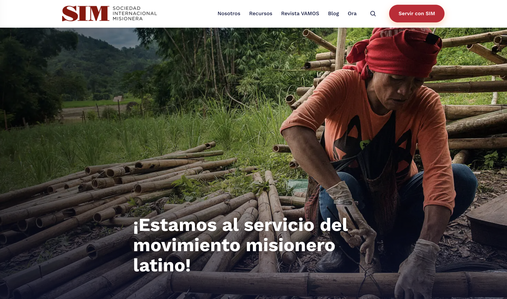
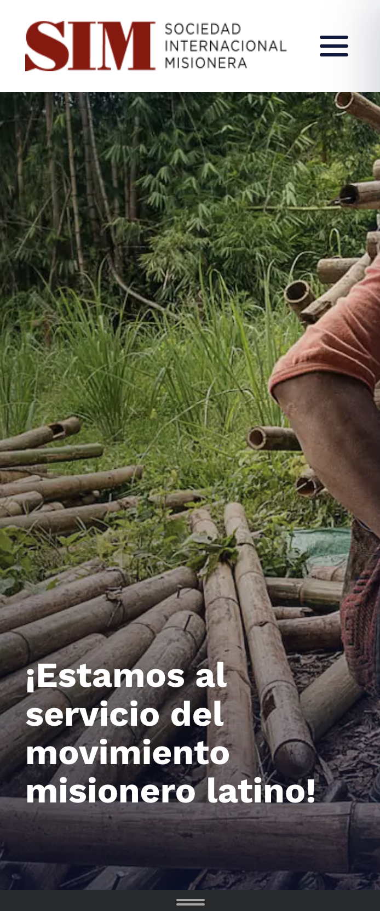
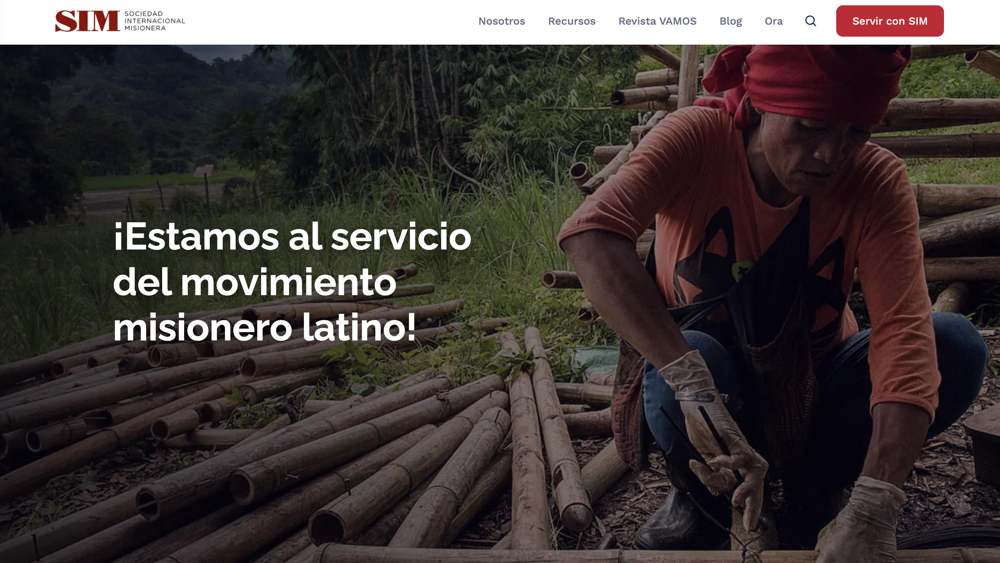
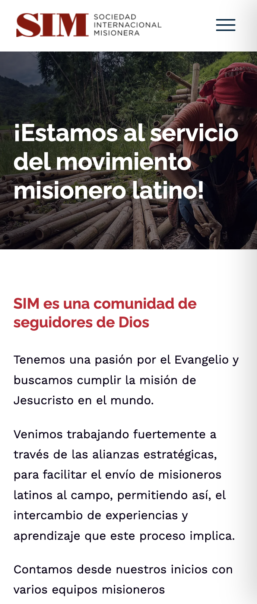

# Building a Homepage POC with Claude: Opus 4.8 vs Fable

> **Status:** Draft — unpublished
> **Series:** Migrating misionessim.org to Next.js

---

We're migrating [misionessim.org](https://misionessim.org) — a WordPress + Elementor site for SIM Latinoamérica, a Latin American missionary organisation — to a modern Next.js stack. Before committing to a full migration, we ran a proof of concept: could an AI coding agent rebuild the homepage convincingly enough to persuade a PM that the move was worth making?

We ran the same prompt against two Claude models: **Opus 4.8** and **Fable**. The results told us more about how these models work than we expected.

---

## The prompt

We gave both models the same starting instruction:

```
See the site https://misionessim.org/ . Create just the homepage as a local replica
using HTML, CSS, JS. This is a POC. I'd like to convince the PM that we can make a
clone of a Wordpress site and migrate this to a static NextJS app. If we can do this
in HTML/CSS, there's a good chance we can replicate this in NextJS. Create a plan
first. There are many animations. The parallax would be good to have. The others are
less important. Ask me questions to clarify needs
```

That's it. No mockup, no design file, no component library. Just the live URL and a goal. The prompt even explicitly invited questions — "Ask me questions to clarify needs." How each model handled that invitation turned out to be the most revealing difference between them.

---

## Opus 4.8: capable, but conversational

Opus 4.8 approached the task methodically. It inspected the live site's DOM, pulled the design tokens (brand colours, fonts, spacing), and produced a solid first pass. But it needed guidance.

Getting from a first draft to something convincing took **multiple back-and-forth prompts**: nudges about the hero height, the fixed-white header behaviour, the parallax sections, the mobile breakpoints. Each iteration required the user to look at the result, notice what was off, and say so. Opus did exactly what it was asked each time — it just wasn't looking at the output itself.

The cost of this session was noticeably higher than Fable's because of the iteration loop.

---

## Fable: autonomous iteration

The prompt invited questions. Opus asked some. Fable answered them itself by looking at the output.

Fable took a different path. After the initial analysis it began **autonomously taking screenshots at multiple viewport sizes** — desktop (1440×900), tablet (768×1024), and mobile (375×812) — comparing them against the live site, and deciding on its own what needed fixing. It didn't wait to be told the mobile hero was the wrong height; it saw it, flagged it, and corrected it.

The result was a near pixel-perfect replica reached in a single session, at a fraction of the prompt-back-and-forth cost.

---

## The result

Both models produced a working static homepage (HTML + CSS + JS). Here's how they compare:

### Opus 4.8

**Desktop (1440×900)**



**Mobile (375×812)**



### Fable

**Desktop (1440×900)**



**Mobile (375×812)**



Key details correctly reproduced by both models:
- Fixed always-white 71px header with the "Servir con SIM" CTA
- 95vh parallax hero with the photo + overlay + Raleway headline
- Brand colours (`#C91430` red, `#002F49` navy) and Raleway/Work Sans fonts
- Responsive collapse to a compact mobile banner
- Three parallax background sections through the page

---

## What this tells us

The capability gap between the models isn't in correctness — both got there. The gap is in **autonomy**. Fable's ability to observe its own output, form a judgement about it, and act without being asked is what made the difference in cost and time.

For a project like a full site migration — where dozens of pages need to be built and verified — that autonomy compounds. The agent that checks its own work is significantly cheaper to run than one that needs a human in the loop for each viewport check.

That's what convinced us to proceed with the migration.

---

## What comes next

With the POC approved, we drew up a full migration plan: 8 phases, Contentful as the content backend for the 336 blog posts and 119 magazine editions, Playwright visual-regression tests against live-site baselines, and Lighthouse CI performance gates.

[Read the migration plan →](../docs/nextjs-migration-analysis.md)
